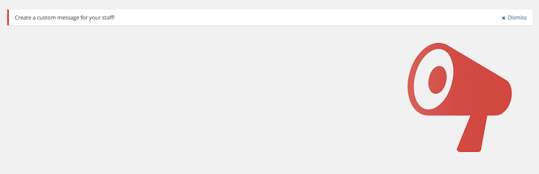
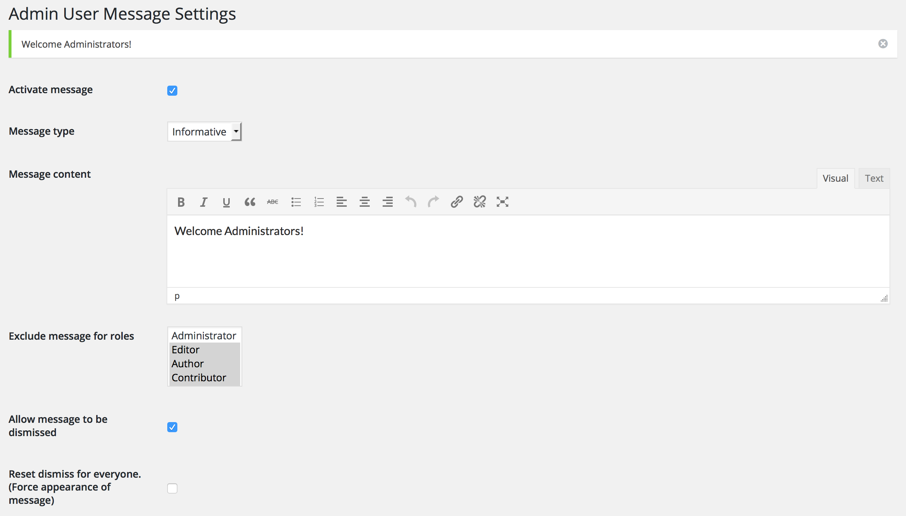

<!-- DO NOT EDIT THIS FILE; it is auto-generated from readme.txt -->
# Admin User Message

Add message to users of your site. Choose wheter they can dismiss it or not.

**Contributors:** [jonathanbardo](http://profiles.wordpress.org/jonathanbardo)  
**Tags:** [admin](http://wordpress.org/plugins/tags/admin), [message](http://wordpress.org/plugins/tags/message)  
**Requires at least:** 4.2  
**Tested up to:** 4.3  
**Stable tag:** trunk (master)  
**License:** [GPLv2 or later](http://www.gnu.org/licenses/gpl-2.0.html)  

## Description ##

**Note: This plugin will only work with WordPress 4.0 or higher**

This plugin will enable the site administrator to easily create an admin message present on all pages. The admin has the option to let the user dismiss the message for the duration of his session.

## Screenshots ##

### Admin settings page

## Changelog ##

### 0.0.8 ###
Add WordPress 4.3 compatibility

### 0.0.7 ###
Added .pot and french translation

### 0.0.6 ###
Added core dismiss button added in 4.2

### 0.0.5 ###
Fix dismiss PHP error on logout

### 0.0.4 ###
Fix dismiss JS error

### 0.0.3 ###
Change css for dismiss button

### 0.0.2 ###
Conserve wysiwyg line break on display

### 0.0.1 ###
Initial release.

